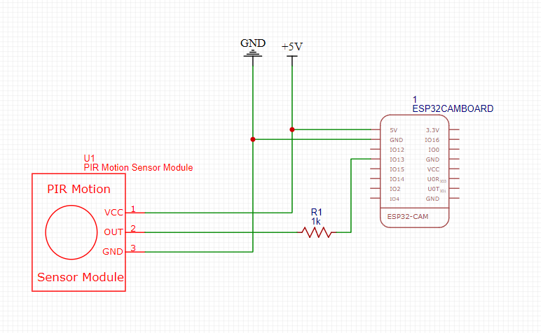
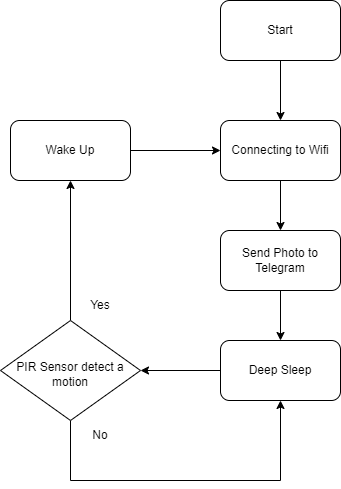
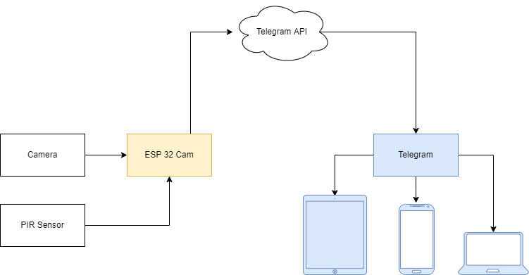

# Motion-Sensor-Photo-Camera-ESP32CAM0

## Setup ESP32 CAM

Install requirement tools

- [Arduino](https://www.arduino.cc/)
- [Telegram](https://web.telegram.org/)

Install library

- [Universal Telegram Bot Library](https://github.com/witnessmenow/Universal-Arduino-Telegram-Bot)
- [Arduino JSON](https://arduinojson.org/)
- [ESP32CAM AI Thinker](https://randomnerdtutorials.com/installing-the-esp32-board-in-arduino-ide-windows-instructions/)

Open arduino file in esp32cam folder

Upload your code to ESP32CAM by selecting AI Thinker ESP32CAM as Board Manager

## Circuit schematic

Required Components

- ESP32CAM
- PIR Sensor
- ESP32CAM Downloader
- OV2640 Camera

## Program flowchart

